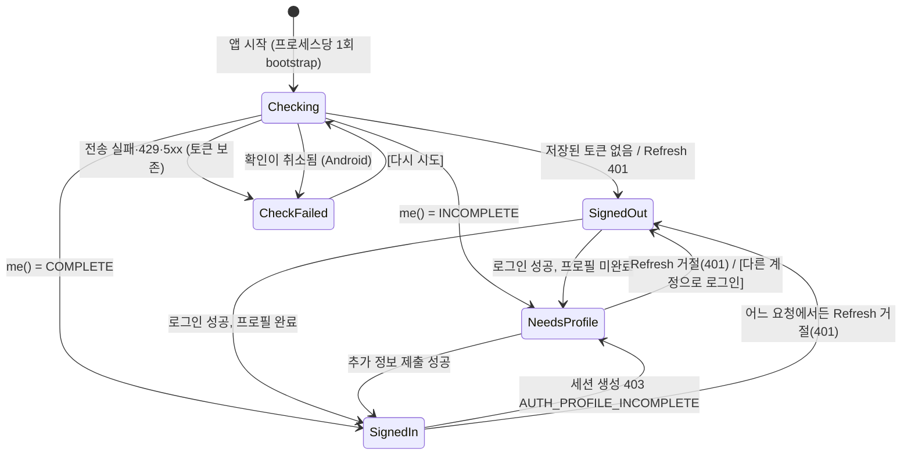

# 소셜 로그인 게이트 (KAN-224)

앱 첫 화면(웹 인트로) 앞에 계정 관문을 세웠다. 구글·카카오·네이버(iOS는 애플까지)로 로그인하고, 추가 정보
(이메일·이름·생년월일·성별·출신지역)가 다 차야 테스트로 들어간다. 서버 쪽 계약은 KAN-223(`Accentury_Server`
`backend/.../auth/`, API 명세서 §3.9~§3.13)이다.

이 문서가 KAN-224의 정본이다. 로고 출처와 브랜드 가이드 대조는 [social-login-logos.md](social-login-logos.md),
iOS 계층 배치는 [ios-port.md](ios-port.md) §11, 버튼·입력 칸 규칙은 [design-tokens.md](design-tokens.md) §8에 있다.

## 1. 개요

### 흐름



| 상태 | 화면 | 코드 |
|---|---|---|
| `Checking` | 스플래시(안드로이드 `setKeepOnScreenCondition`) / 런치 화면 얼굴(iOS `AuthCheckScreen`) | `AuthGateController.bootstrap()` |
| `CheckFailed` | 대기·오류 블록 + [다시 시도] | 망이 끊긴 사용자를 로그아웃시키지 않으려는 상태다 |
| `SignedOut` | 로그인 (`auth/LoginScreen.kt` · `Auth/LoginScreen.swift`) | |
| `NeedsProfile` | 추가 정보 (`auth/ProfileScreen.kt` · `Auth/ProfileScreen.swift`) | |
| `SignedIn` | 기존 테스트 흐름(WebView 인트로) | 안드로이드 `MainActivity`의 `AuthGate`, iOS `AuthGateView` |

시작 확인은 저장된 Access로 `me()`를 바로 부르지 않고 **Refresh부터 한다.** Refresh가 살아 있는지가 로그인
상태의 정본이고, 오래 안 연 앱의 Access(30분)는 어차피 만료돼 있다. 거절(401)은 로그인 화면으로,
판정 없음(망·5xx)은 [다시 시도]로 깔끔히 갈린다 (`AuthGateController.kt` KDoc).

안드로이드의 시작 확인과 [다시 시도]는 둘 다 `AuthGateController.retry()`로 Application의 앱 수명 스코프에서
돈다. 화면 스코프에서 돌리면 회전이 확인을 취소해 스플래시가 영영 안 걷혔다. `bootstrap()` 자체도 취소되면
CheckFailed로, 저장소가 던지면 SignedOut으로 끝나 `Checking`에 남거나 앱이 죽지 않는다. 로그인 성공 뒤 저장과
로그아웃의 로컬 정리는 `NonCancellable`로 끝까지 간다. iOS는 비구조 `Task`라 뷰가 사라져도 취소되지 않아 같은 문제가 없다.

테스트 흐름은 `SignedIn`일 때만 화면에 있다. 로그인이나 추가 정보 화면으로 밀려나면 흐름 화면이 통째로
내려가고, iOS는 저장해 둔 시작 게이트·세션도 지운다(`TestFlowModel.clearSavedState()`). 진행 중이던 응시를
다른 계정 상태로 이어 가지 않게 하려는 구조다.

### 결정

| 항목 | 결정 | 근거·출처 |
|---|---|---|
| 버튼 모양 | Papercut 보조 버튼 그대로 + 왼쪽에 각 사 공식 로고 | 2026-09-28 팀장 결정. 가이드 위반 목록은 social-login-logos.md |
| 버튼 순서 | 구글 → 카카오 → 네이버 (+ iOS 애플) | 2026-09-28 팀장 결정 "구글, 카카오, 네이버, iOS는 apple 추가". `LOGIN_PROVIDERS` |
| 히어로 배치 | 웹 인트로 히어로(워드마크·두 줄 제목·곡선 밑줄·부제)를 버튼 묶음 위 남은 칸의 세로 가운데 | 2026-09-28 팀장 결정 (커밋 cdfa46d) |
| 설정 없는 IdP | 버튼을 숨긴다 | 눌러야 SDK 오류로 떨어질 버튼을 세울 이유가 없다 (`visibleProviders`). 그래서 릴리스 빗장이 필요하다 (§4) |
| IdP 화면 취소 | 오류 안내 없이 로그인 화면으로 | 로그인하지 않겠다는 뜻이지 실패가 아니다 (`IdpOutcome.Cancelled`) |
| 로그아웃 화면 | **KAN-247 설정 화면 — Android(1단계)·iOS(2단계) 구현.** 웹 화면 오른쪽 위 네이티브 톱니(팀 결정 A안: 웹·브리지 무변경, 네이티브 화면이 WebView를 덮는 동안엔 숨김) → 설정 화면(계정: 이름·이메일·로그인 방식) → [로그아웃] → 확인 창 → `logout { IdpLogout.all }` → 로그인 화면. 설정 화면은 TestFlow 위에 덮어 WebView를 살려 둔다(Android `auth/SettingsScreen.kt`, iOS `Auth/SettingsScreen.swift` — `AuthGateView`의 `ZStack`). 추가 정보 화면의 [다른 계정으로 로그인](Text 버튼)도 그대로 | 추가 정보 화면 출구는 만 14세 미만 거절·계정 잘못 고른 사용자가 갇히지 않게 하는 것. 계정 값은 게이트의 `SignedIn.user`라 별도 `/v0/users/me` 호출 없음. 서버 폐기가 실패해도 로컬 토큰은 지운다(`AuthGateController.logout`). [회원 탈퇴]는 계정 섹션 맨 아래에 **KAN-251** |
| 실패 후 재응시 광고 | 이 티켓 밖, **KAN-248** | |
| 개인정보처리방침 버전 | `2026-09-29` (Android `PRIVACY_POLICY_VERSION`, iOS `privacyPolicyVersion`) | **KAN-240 확정 (2026-09-29).** 계정 수집 항목을 반영한 방침 개정본의 버전이고 시행일과 같은 날짜다. 서버는 게시 중인 버전(`AccenturyProperties.Auth.PRIVACY_POLICY_VERSION`)과 정확히 같은 값만 동의로 받고, 다르면 400 `AUTH_CONSENT_REQUIRED`다. 방침을 개정하면 서버 상수, privacy.html, 두 플랫폼 상수를 함께 올린다. 서버가 먼저 바뀌면 그동안 옛 빌드의 새 가입이 막힌다 |

동의는 로그인 화면이 받는다. 동의 체크 없이는 버튼이 눌리지 않으므로 `AuthApi.login`은 늘
`privacyConsent: true`로 나간다. 기존 계정의 재로그인에서는 서버가 두 값을 보지 않는다.

## 2. 토큰

서버가 주는 것은 Access JWT(30분)와 Refresh(30일, 쓸 때마다 회전)다 (서버 `application.yml`
`accentury.auth.*`).

### 보관

| | Android (`auth/KeystoreTokenStore.kt`) | iOS (`Auth/KeychainTokenStore.swift`) |
|---|---|---|
| 암호화 | Android Keystore의 AES-256-GCM 키(`accentury_auth_tokens`)로 직접 암호화 | 키체인 항목이 기기 키로 잠긴다 |
| 저장 자리 | DataStore Preferences `auth_tokens`에 `base64(IV ‖ 암호문)` 한 줄 | `kSecClassGenericPassword`, service `com.accentury.app.auth` / account `tokens` |
| 백업·기기 이전 | 제외 — `res/xml/backup_rules.xml`·`data_extraction_rules.xml`이 `datastore/auth_tokens.preferences_pb`를 뺀다 | 제외 — `kSecAttrAccessibleAfterFirstUnlockThisDeviceOnly` |
| 읽기 실패 | 값을 지우고 로그아웃으로 본다 (키는 백업으로 따라가지 않아 파일만 복원되면 영영 못 푼다). 파일 손상은 `ReplaceFileCorruptionHandler`가 빈 값으로 바꾸고, 그 밖의 IOException도 null이다 — `read()`는 던지지 않는다(던지면 시작마다 죽는다) | 같다 (디코드 실패는 지우고 nil) |
| 쓰기 실패 | `save`가 false를 돌려준다 (Keystore·Cipher 예외, DataStore IOException을 삼킨다) | `SecItemAdd`가 `errSecSuccess`가 아니면 false |

쓰기가 실패해도 메모리 값은 새 쌍으로 바뀐다 — 이 프로세스 안에서는 회전된 쌍이 정본이고, 옛 쌍을 들고 있으면
다음 갱신이 죽은 Refresh를 내 패밀리가 폐기된다. 첫 로그인의 저장 실패는 로그인 실패로 다룬다(저장소를 비우고
로그인 화면에 [다시 시도] 안내) — 그대로 들여보내면 다음 실행 때 조용히 로그아웃되기 때문이다. 갱신 회전의 저장
실패는 이번 요청을 그대로 성공시키고, 다음 실행 때 옛 Refresh가 거절돼 로그인 화면으로 가는 열화를 받아들인다.

EncryptedSharedPreferences(security-crypto)를 쓰지 않은 것은 라이브러리가 deprecated 됐기 때문이다. 같은 일을
플랫폼 API로 직접 한다. iOS가 `AfterFirstUnlock`인 것은 업로드가 백그라운드 실행 시간 안에서 세션 생성·갱신을
부를 수 있어서다 — `WhenUnlocked`면 그 사이 잠금에 걸린다.

### 갱신은 한 번에 하나

Refresh는 쓸 때마다 회전하고, 이미 회전된 Refresh를 다시 내면 서버가 탈취로 보고 패밀리째 폐기한다
(401 `AUTH_REFRESH_REUSED`). Access가 만료된 순간 요청 다섯 개가 동시에 401을 받아 각자 갱신하면 첫 갱신
뒤 나머지 넷이 옛 Refresh를 내서 **정상 사용자가 로그아웃된다.** 그래서 `TokenRefresher`가 줄을 세운다
(안드로이드 `Mutex`, iOS 액터 + `tail` 사슬 — 액터는 `await`에서 재진입하므로 액터만으로는 줄이 서지 않는다).
줄 선 사이 저장소의 Access가 401을 받은 요청이 실어 보낸 값과 다르면 누군가 먼저 갱신한 것이라 서버에
묻지 않고 그 값을 쓴다.

토큰을 지우는 것은 서버가 Refresh를 **401로 거절했을 때뿐이다.** 전송 실패·429·5xx에서 지우면 지하철에서
앱을 연 사용자가 매번 로그아웃된다.

401 → 갱신 → 한 번 재시도는 안드로이드 `TokenAuthenticator`(OkHttp Authenticator), iOS
`AuthorizedSession`(URLSession 요청 함수를 감싼다)이 한다. 재시도마저 401이면 포기한다(무한 고리 방지).
안드로이드 인증 클라이언트는 디스패처를 따로 갖는다 — 공유하면 401을 받은 요청 다섯이 호스트당 동시 5개
자리를 쥔 채 갱신을 기다려 갱신 호출이 영영 못 나간다 (`AuthClients` KDoc).

### 어떤 요청에 Bearer가 실리나

| 요청 | Bearer(Access JWT) | 비고 |
|---|---|---|
| `POST /v0/auth/login`, `POST /v0/auth/refresh` | 없음 | 토큰 없는 클라이언트. 갱신이 갱신을 부르는 고리를 끊는다 |
| `GET /v0/users/me`, `PUT /v0/users/me/profile`, `POST /v0/auth/logout` | 있음 | 인증 클라이언트 |
| `POST /v0/sessions` (세션 생성) | 있음 | 서버가 세션을 계정에 묶고(`test_session.user_id`) 출신지역을 계정 값으로 채운다. 15초 상한 클라이언트 위에 얹는다 |
| 세션 범위 API (업로드 등) | **없음** | 기존대로 `Authorization`에 `st_` 세션 토큰이 실린다. 인증 클라이언트를 타면 그 자리를 덮는다 |

**재응시 토큰은 본문으로 옮겼다.** 예전(KAN-107)에는 이전 세션 토큰을 `Authorization: Bearer st_...`로
보냈는데 그 헤더를 이제 Access가 차지한다. 세션 생성 본문의 `previousSessionToken`으로 보내고, 서버는 본문
값을 헤더보다 우선해 읽는다 (`session/SessionClient.kt` `CreateSessionBody`).

**403 `AUTH_PROFILE_INCOMPLETE`.** 세션 생성이 이 코드로 막히면 앱이 들고 있던 `SignedIn`이 낡은 것이다(다른
기기에서 값이 지워지는 등). 재시도 안내를 띄우지 않고 시작 게이트를 되감은 뒤 추가 정보 화면으로 돌린다
(`AuthGateController.onProfileIncomplete`, 안드로이드 `leaveForProfile`).

## 3. 콘솔 설정

값이 어느 키로 가는지는 §4 표가 정본이다. 번들 ID·패키지명은 두 플랫폼 모두 `com.accentury.app`이다.

### 구글 (Google Cloud Console › API 및 서비스 › 사용자 인증 정보)

OAuth 클라이언트는 한 프로젝트 안에 셋 이상을 만든다.

1. **OAuth 동의 화면**을 먼저 구성한다. 범위는 기본(openid·email·profile)만 쓰므로 민감 범위 검수가 없다.
   "테스트" 상태에서는 등록한 테스트 사용자만 로그인되므로 출시 전에 "프로덕션"으로 게시한다.
2. **웹 애플리케이션** 클라이언트 → 클라이언트 ID가 `GOOGLE_SERVER_CLIENT_ID`다. 두 플랫폼이 모두 이 값을
   `serverClientId`로 지정해 ID 토큰의 `aud`를 하나로 모은다. **서버 `ACCENTURY_AUTH_GOOGLECLIENTID`도 같은
   값이다.** 이 클라이언트에는 리디렉션 URI가 필요 없다.
3. **Android** 클라이언트 — 패키지 `com.accentury.app` + SHA-1. 앱은 이 클라이언트 ID를 어디에도 적지
   않는다(Credential Manager가 패키지·서명으로 찾는다). 대신 등록이 없으면 계정 선택이 실패한다.
   - 디버그: 개발자마다 `~/.android/debug.keystore`의 SHA-1이 다르므로 사람마다 하나씩 등록한다
     (`keytool -list -v -alias androiddebugkey -keystore ~/.android/debug.keystore -storepass android`,
     JAVA_HOME은 Android Studio JBR).
   - 릴리스: **Play Console › 앱 무결성 › 앱 서명의 "앱 서명 키 인증서" SHA-1**을 등록한다. 스토어로 나가는
     APK는 구글이 이 키로 다시 서명한다. 우리는 KAN-174에서 우리 키스토어를 앱 서명 키로 올렸으므로 이
     SHA-1은 `~/keys/accentury-release.jks`의 SHA-1과 같다 ([android-release-signing.md](android-release-signing.md) §1).
     워크플로 아티팩트 APK를 직접 설치해 볼 때도 같은 키라 한 클라이언트로 충분하다.
4. **iOS** 클라이언트 — 번들 ID `com.accentury.app`. 클라이언트 ID가 `GOOGLE_IOS_CLIENT_ID`이고, 콘솔이 함께
   보여 주는 "iOS URL 스킴"(`com.googleusercontent.apps.<번호>-<문자열>`, 클라이언트 ID를 거꾸로 쓴 것)이
   `GOOGLE_REVERSED_CLIENT_ID`다. 이 스킴이 `Info-*.plist`의 `CFBundleURLTypes`(`.google`)로 들어가 인증 창이
   앱으로 돌아오는 문이 된다.

### 카카오 (카카오 개발자 콘솔)

카카오톡 공유(KAN-30·KAN-180)에 쓰던 **같은 앱의 같은 네이티브 앱 키**를 쓴다. 새 시크릿이 없다.

1. [카카오 로그인]을 **사용 설정 ON**으로 켠다. (2025 콘솔 개편 뒤 메뉴 이름이 바뀐 적이 있어, 못 찾으면
   앱 설정의 제품 목록에서 "카카오 로그인"을 찾는다.)
2. 플랫폼 등록은 공유 때 한 것을 그대로 쓴다: [앱] › [플랫폼 키] › [네이티브 앱 키] 아래
   - Android: 패키지 `com.accentury.app`, 키 해시 — 디버그(개발자별)와 릴리스 `mbUry3g8iSvbM3Ok5NlJ1ZYUIIo=`
     ([android-release-signing.md](android-release-signing.md) §4)
   - iOS: 번들 ID `com.accentury.app` — **공유 때 아직 등록 전이었다** (ios-port.md §10 「코드 밖에 남은
     것」). 로그인도 이것이 없으면 실패한다.
3. 리디렉트는 네이티브 SDK 규칙 `kakao{네이티브 앱 키}://oauth`다. 콘솔에 따로 적는 값이 아니라 앱이 스킴을
   선언한다 — 안드로이드 `AndroidManifest.xml`의 `AuthCodeHandlerActivity`(`${kakaoScheme}`), iOS
   `Info-*.plist`의 `kakao$(KAKAO_NATIVE_APP_KEY)`.
4. **동의항목.** 서버가 읽는 값은 이메일(유효·인증된 것만)·이름·성별·출생연도·생일·닉네임·프로필 사진이다
   (`KakaoIdpVerifier`). 검수·비즈 앱 없이 켤 수 있는 것은 닉네임·프로필 사진이고, 이메일·이름·성별·생일·
   출생연도는 비즈 앱 전환과 권한 신청이 필요하다(콘솔에서 다시 확인). **켜지 않아도 로그인은 된다** — 빈 값은
   추가 정보 화면이 받으므로 IdP가 주는 값은 미리 채우기일 뿐이다.
5. 서버 `ACCENTURY_AUTH_KAKAOAPPID`는 **앱 ID(숫자)**다(네이티브 앱 키가 아니다). 서버가
   `access_token_info`의 `app_id`와 대조해, 다른 앱이 받은 카카오 토큰으로 우리 계정에 들어오는 것을 막는다.

### 네이버 (네이버 개발자 센터 › Application › 애플리케이션 등록)

1. 사용 API **네이버 로그인**. 제공 정보는 이메일·이름·성별·생일·출생연도를 고른다(서버 `NaverIdpVerifier`가
   읽는 값, 휴대폰 번호는 KAN-222 결정으로 읽지 않는다). 카카오와 같이 없어도 추가 정보 화면이 받는다.
2. 서비스 환경: **Android** — 패키지 `com.accentury.app`. **iOS** — 번들 ID `com.accentury.app`과 **URL
   Scheme**. 여기 적은 스킴이 `NAVER_URL_SCHEME`이고 `Info-*.plist`의 `CFBundleURLTypes`(`.naver`)로 들어간다.
   네이버 앱 로그인이 우리 앱으로 돌아오는 문이라 둘이 다르면 로그인이 끝나지 않는다. 예시 값은
   `Local.xcconfig.example`의 `accenturynaverlogin`.
3. 발급된 **Client ID / Client Secret**이 `NAVER_CLIENT_ID`·`NAVER_CLIENT_SECRET`이다. 두 플랫폼이 같은 값이다.
   Secret이 앱에 박히는 것은 네이버 SDK의 설계다(기기에서 토큰 교환을 한다).
4. **개발 중 상태에서는 [멤버 관리]에 등록한 네이버 ID만 로그인된다.** 실기기 실증(§6) 전에 테스터 ID를
   등록하고, 출시 전에 **검수 요청**을 넣는다.
5. 서버에도 같은 Client ID와 Secret을 넣는다 (KAN-243). 네이버에는 카카오 `app_id` 같은 발급 앱 조회 API가
   없어서, 앱이 로그인 요청에 SDK Refresh 토큰(`refreshToken`)을 함께 싣고 서버가 그것을 우리 Client로 교환해
   성공해야 우리 앱의 토큰으로 본다. 교환으로 받은 Access 토큰으로 `/v1/nid/me`를 부른다. 서버 쪽 이름은
   아래 표의 `naver-client-id`, `naver-client-secret`이다.

### 애플 (Apple Developer › Certificates, Identifiers & Profiles)

1. App ID `com.accentury.app`에 **Sign in with Apple** capability를 켠다. 앱 쪽 entitlement
   (`Accentury.entitlements`의 `com.apple.developer.applesignin` = `Default`)는 들어가 있고, 자동 서명이
   export 때 그 키를 보고 프로파일에 싣는다. `ios-release.yml`이 서명된 `.app`의 entitlement에서 이 키를 다시 확인한다.
2. 앱에 넣을 설정값은 없다. 서버 `ACCENTURY_AUTH_APPLEBUNDLEID` = `com.accentury.app`(identityToken의 `aud`).
3. nonce: 앱이 원문(32바이트 난수 → 16진 64자)을 만들어 **SHA-256만** 애플 요청에 싣고 원문은 서버로 보낸다.
   서버가 원문을 해시해 ID 토큰의 `nonce` 클레임과 대조한다 (`AppleNonce.swift`).
4. 심사:
   - **Guideline 4.8 (Login Services)** — 다른 소셜 로그인을 주는 앱은 애플 로그인을 같은 무게로 줘야 한다.
     같은 크기·모양 버튼이라 충족한다고 보지만, 버튼 면이 흰색·검정이 아닌 점은 HIG와 어긋난다
     (social-login-logos.md 「Sign in with Apple — HIG 대조」).
   - **Guideline 5.1.1(v)** — 계정을 만들 수 있는 앱은 **앱 안에서 계정 삭제**를 제공해야 한다. 지금은 없다.
     스토어 제출 전에 별도 티켓으로 막아야 하는 선행 조건이다 (서버 `app_user.deleted_at` 자리는 있다).

### 서버가 필요한 값 (KAN-223)

서버 `backend/src/main/resources/application.yml`의 `accentury.auth` 절. 배포 값은 SSM이 넣는다.

| 설정 | SSM 이름 | 값 | 앱 쪽 짝 |
|---|---|---|---|
| `google-client-id` | `ACCENTURY_AUTH_GOOGLECLIENTID` | 구글 **웹** 클라이언트 ID | `GOOGLE_SERVER_CLIENT_ID` (같은 값) |
| `apple-bundle-id` | `ACCENTURY_AUTH_APPLEBUNDLEID` | `com.accentury.app` | 번들 ID |
| `kakao-app-id` | `ACCENTURY_AUTH_KAKAOAPPID` | 카카오 **앱 ID(숫자)** | `KAKAO_NATIVE_APP_KEY`와 같은 앱 |
| `naver-client-id` | `ACCENTURY_AUTH_NAVERCLIENTID` | 네이버 **Client ID** (KAN-243) | 앱 `NAVER_CLIENT_ID`와 같은 값 |
| `naver-client-secret` | `ACCENTURY_AUTH_NAVERCLIENTSECRET` (SecureString) | 네이버 **Client Secret** (KAN-243) | 앱 `NAVER_CLIENT_SECRET`과 같은 값 |
| `jwt-secret` | `ACCENTURY_AUTH_JWTSECRET` (SecureString) | Access JWT 서명 키 32바이트 이상 | — |
| `fake-idp` | `ACCENTURY_AUTH_FAKEIDP` | 로컬만 `true`. deploy 프로파일에서 켜면 기동 실패 (`AuthConfig`) | 앱 `FAKE_IDP` |

네이버 Client Secret을 뺀 IdP 값은 비밀이 아니다. 비어 있거나 자리 표시 값이면 **그 IdP 로그인만** 401
`AUTH_IDP_TOKEN_INVALID`이고 다른 IdP와 응시는 영향이 없다. 네이버는 ID와 Secret 중 하나만 빠져도 네이버 로그인이
401이다(위 네이버 5번).

## 4. 키 주입

앱 쪽 우선순위는 카카오 키(KAN-30)와 같다. 안드로이드 `idpProperty()`: `-P<키>=` → 환경변수 →
`local.properties`의 `<키>=`. iOS: `Base.xcconfig`의 빈 기본값 → `Local.xcconfig` → 명령줄 빌드 설정.
**빈 값이 정상 상태다** — 값이 빈 IdP는 버튼이 숨고 나머지는 그대로 돈다. 그래서 스토어로 나가는 빌드만
빈 값을 막는 빗장이 따로 있다.

| 키 | Android `-P` / 환경변수 / `local.properties` | iOS `xcconfig` (`Local.xcconfig`·명령줄) | GitHub 시크릿 | 릴리스 빗장 |
|---|---|---|---|---|
| 구글 서버(웹) 클라이언트 ID | `-PgoogleServerClientId` / `GOOGLE_SERVER_CLIENT_ID` / `googleServerClientId=` | `GOOGLE_SERVER_CLIENT_ID` | `GOOGLE_SERVER_CLIENT_ID` (두 플랫폼 공유) | A: `-PrequireGoogleServerClientId=true` + BuildConfig 검사 · I: `REQUIRE_IDP_CONFIG=YES` + `.ipa` plist 검사 |
| 구글 iOS 클라이언트 ID | — | `GOOGLE_IOS_CLIENT_ID` | `GOOGLE_IOS_CLIENT_ID` | I: 위와 같음 |
| 구글 역순 클라이언트 ID(URL 스킴) | — | `GOOGLE_REVERSED_CLIENT_ID` | `GOOGLE_REVERSED_CLIENT_ID` | I: `REQUIRE_IDP_CONFIG` + `.ipa`의 `CFBundleURLTypes` `.google` 스킴 검사 |
| 네이버 Client ID | `-PnaverClientId` / `NAVER_CLIENT_ID` / `naverClientId=` | `NAVER_CLIENT_ID` | `NAVER_CLIENT_ID` (공유) | A: `-PrequireNaverClient=true` + BuildConfig 검사 · I: `REQUIRE_IDP_CONFIG` + plist 검사 |
| 네이버 Client Secret | `-PnaverClientSecret` / `NAVER_CLIENT_SECRET` / `naverClientSecret=` | `NAVER_CLIENT_SECRET` | `NAVER_CLIENT_SECRET` (공유) | 위와 같음 |
| 네이버 URL 스킴 | — | `NAVER_URL_SCHEME` | `NAVER_URL_SCHEME` | I: `REQUIRE_IDP_CONFIG` + plist·`.naver` 스킴 검사 |
| 카카오 네이티브 앱 키 | `-PkakaoNativeAppKey` / `KAKAO_NATIVE_APP_KEY` / `kakaoNativeAppKey=` | `KAKAO_NATIVE_APP_KEY` | `KAKAO_NATIVE_APP_KEY` (공유, KAN-163에서 등록됨) | A: `-PrequireKakaoNativeAppKey=true` + BuildConfig·DEX 검사 · I: 시크릿 존재 검사 + plist 검사 |
| 가짜 IdP | `-PfakeIdp=true` / (없음) / `fakeIdp=true` — **debug만** | `FAKE_IDP = YES` — **Debug만** | 없음 | A: 릴리스 BuildConfig `FAKE_IDP = false` 검사 · I: Release plist에 `FAKE_IDP` 키가 없는지 검사 |
| 애플 | — | 없음 (번들 ID + entitlement) | 없음 | I: 서명된 앱 entitlement에 `com.apple.developer.applesignin` |

A = `.github/workflows/app-release.yml`, I = `.github/workflows/ios-release.yml`.

- 안드로이드 빗장 스위치는 값 없이 이름만 줘도(`-PrequireNaverClient`) 켜진다 — gradle이 `""`를 넘긴다.
  `=true`는 `toBoolean()`으로 켜짐, `=false`는 꺼짐이다 (`switchOn()`).
- 네이버 빗장 하나가 ID와 Secret을 함께 본다. 둘 중 하나만 있어도 버튼은 숨기 때문이다
  (`configuredProviders()`).
- iOS `REQUIRE_IDP_CONFIG`는 `project.yml`의 preBuild 스크립트이고 `CONFIGURATION=Release`에서만 돈다. 카카오
  키는 공유 때부터 빗장 없이 명령줄로 주던 값이라 여기서 보지 않는다 — 대신 워크플로의 시크릿 검사와
  `.ipa` 검사가 잡는다.
- 워크플로는 값을 `env:`로만 받고 절대 찍지 않는다. iOS는 xcodebuild 빌드 설정이 원리상 명령줄 인자라
  `ps`에 보이지만, 러너가 일회용이고 이 값들이 전부 앱에 박혀 기기로 나가는 값이라 감수한다
  (`ios-release.yml` 헤더 「비밀이 로그·프로세스 목록에 남지 않게」).

## 5. 로컬 개발 — 가짜 IdP

IdP 콘솔 없이 게이트·추가 정보 화면을 돌리는 길이다. 서버가 `accentury.auth.fake-idp=true`면 토큰 자리에
온 `fake:<sub>`를 IdP에 묻지 않고 그 sub로 로그인시킨다 (서버 `IdpVerifiers`, sub 형식 `[A-Za-z0-9._-]{1,64}`).

| 어디 | 켜는 법 |
|---|---|
| Android | `./gradlew :app:installDebug -PfakeIdp=true`, 또는 `local.properties`에 `fakeIdp=true` (Android Studio Run은 `-P`를 못 넘긴다). release는 늘 `false` |
| iOS | `Local.xcconfig`에 `FAKE_IDP = YES`, 또는 `xcodebuild ... FAKE_IDP=YES`. 읽는 코드가 `#if DEBUG`이고 Release는 `Release.xcconfig`가 `NO`로 못 박는다 |
| 서버 | `docker-compose.yml`이 이미 `ACCENTURY_AUTH_FAKEIDP: "true"`다. `bootRun`으로 띄우면 `./gradlew bootRun --args="--accentury.auth.fake-idp=true"` (Refresh 저장소 Redis가 떠 있어야 한다) |

- 켜면 설정과 무관하게 버튼이 다 보이고, 누르면 SDK를 건너뛰고 `fake:dev-<provider>`(소문자, 예:
  `fake:dev-kakao`)를 보낸다. 제공자마다 sub가 달라 버튼마다 다른 계정이 된다.
- 토큰은 진짜와 같은 칸에 싣는다 — 구글·애플은 `idToken`, 카카오·네이버는 `accessToken`. 서버가 필수 필드
  검사를 가짜 판정보다 먼저 하기 때문이다. 네이버는 `refreshToken`에도 같은 가짜 값을 싣는다 (KAN-243).
- **애플 가짜 로그인도 nonce를 싣는다.** 애플이면 nonce가 필수라 빠뜨리면 가짜 로그인도 400
  `VALIDATION_FAILED`다. iOS `fakeLoginCredential`이 새 원문 nonce를 만든다.
- 같은 계정으로 처음부터 다시 보려면 서버 DB의 `app_user`에서 그 행(`provider_user_id = 'dev-<provider>'`)을
  지운다.

## 6. 실기기 실증표

**아직 비어 있다.** 가짜 IdP로는 SDK·콘솔 설정·URL 스킴 왕복을 하나도 밟지 않는다. 채울 때 날짜·기기·빌드
(디버그/아티팩트/TestFlight)를 비고에 적는다.

| 플랫폼 | IdP | 최초 로그인 (가입 → 추가 정보) | 재로그인 | 앱 재실행 자동 로그인 | 비고 |
|---|---|---|---|---|---|
| Android | 구글 | | | | |
| Android | 카카오 | | | | 카톡 설치 / 미설치(카카오계정) 둘 다 |
| Android | 네이버 | | | | §7 singleTask 위험 확인 대상 |
| iOS | 구글 | | | | |
| iOS | 카카오 | | | | 카카오 콘솔 iOS 플랫폼 등록 선행 |
| iOS | 네이버 | | | | 네이버 앱 설치 / 미설치 둘 다 |
| iOS | 애플 | | | | 최초 로그인에서만 이름이 온다 |

| 시나리오 | Android | iOS | 확인 방법 |
|---|---|---|---|
| Refresh 거절 → 로그인 화면 | | | 서버에서 그 사용자의 Refresh 패밀리를 지우거나 만료시킨 뒤 앱을 다시 연다. 로그인 화면이 떠야 하고 [다시 시도]가 뜨면 틀린 것이다 |
| 망 끊김 시작 → [다시 시도] | | | 비행기 모드로 앱 시작. 토큰이 남아 있어야 한다(망을 켜고 [다시 시도] → 로그인 없이 진입) |
| 세션 계정 귀속 | | | 응시 하나를 시작한 뒤 서버 DB에서 확인 (아래 쿼리) |
| 프로필 미완료 403 → 추가 정보 | | | DB에서 `profile_completed_at`을 비운 뒤 [시작하기] |

세션 계정 귀속 확인 쿼리 (서버 `V2__app_user.sql`이 `test_session`에 `user_id`를 더했다):

```sql
select s.id, s.created_at, s.user_id, u.provider, u.region
from test_session s left join app_user u on u.id = s.user_id
order by s.created_at desc limit 5;
```

로그인한 앱에서 만든 세션은 `user_id`가 비어 있지 않아야 한다. 비어 있으면 세션 생성에 Bearer가 실리지 않은 것이다.

## 7. 알려진 위험 / 미검증

- **네이버 SDK와 singleTask.** 네이버 SDK 5.12.0에는 `NidOAuthErrorCode.ACTIVITY_IS_SINGLE_TASK` 오류 코드가
  있다. 우리 `MainActivity`는 공유 링크 때문에 `launchMode="singleTask"`다 (KAN-32, `AndroidManifest.xml`
  주석). 이 조합에서 로그인이 거절되는지는 실기기에서 아직 안 봤다. 거절되면 사용자는 [다시 시도] 안내만 보고
  (`IdpOutcome.Failed`) 원인은 `NidOAuth.getLastErrorCode()`에만 남는다.
- **네이버 SDK가 끌어오는 전이 의존성.** `androidx.security:security-crypto:1.1.0-alpha06`(우리가 deprecated라서
  피한 그 라이브러리)과 `com.squareup.okhttp3:logging-interceptor:4.9.3`이 들어온다. 우리 OkHttp는 5.4.0이라
  4.x 인터셉터가 5.x 위에서 돈다. 컴파일·단위 테스트는 통과하지만 SDK의 네트워크 경로는 단위 테스트가 밟지
  않는다 — 네이버 실기기 로그인이 그 확인이다.
- **googleid 1.2.0 고정.** 최신 1.2.1은 Kotlin 2.4 메타데이터로 빌드돼 우리 컴파일러(Kotlin 2.2.10)가 못 읽는다.
  Kotlin을 올릴 때 같이 올린다 (`gradle/libs.versions.toml` 주석).
- **iOS 무서명 시뮬레이터 빌드의 키체인.** 서명 없이 만든 시뮬레이터 빌드(`CODE_SIGNING_ALLOWED=NO`)에서는
  키체인 쓰기가 -34018로 실패한다. 이제 첫 로그인은 저장 실패를 보고 로그인 화면에 [다시 시도] 안내로 남는다(들어가지
  못한다) — 그 빌드에서는 로그인 흐름을 끝까지 볼 수 없다. 로그인·"앱 재실행 자동 로그인"은 서명된 빌드(실기기·
  TestFlight)에서 확인한다.
- **브랜드 가이드와 어긋난 버튼.** 구글·카카오·애플 버튼 면이 각 사 가이드 값이 아니다(팀 결정으로 유지).
  목록과 심사에서 문제가 될 때의 최소 수정은 [social-login-logos.md](social-login-logos.md).
- **iOS 세션 생성 15초 상한이 갱신을 덮지 않는다.** `AuthClients.sessionClient`는 15초 세션으로 첫 요청과 재시도를
  보내지만, 그 사이의 Refresh는 토큰 없는 기본 세션(`URLSession.shared`)으로 나가 이 상한 밖이다. Access가
  만료된 상태에서 망이 느리면 [시작하기] 뒤 대기가 15초를 넘을 수 있다. 안드로이드는 OkHttp `callTimeout`이
  Authenticator 재시도까지 한 호출로 묶는다.
- **계정 삭제 없음** — 애플 5.1.1(v), §3 애플 4번. 스토어 제출 선행 조건이다.
- **로그아웃 화면 없음** — KAN-247. 그 전에는 로그인된 뒤(SignedIn) 로그아웃하려면 앱 데이터를 지워야 한다. 추가 정보 화면에는 [다른 계정으로 로그인]이 있다.
- **개인정보처리방침 버전** — §1 결정 표. KAN-240에서 서버가 허용 버전을 고정하면 앱 값과 맞춘다.
